# PPC → SMA Inverter Modbus Sequence Diagram

**Scope:** Read Modbus → Process PPC logic → Write Modbus, per-inverter OB30 cycle (100 ms)  
**Unit ID:** 3 | **Protocol:** Modbus TCP | **Platform:** SIMATIC S7 (TIA Portal)

---

## 1. OB30 Cycle Overview

```
OB30 TICK (every 100 ms)
│
├─► [A] READ PHASE — FC04 Input Registers
│       ↓ on timeout/exception
│       ├─ Set CommError := TRUE
│       └─ Skip all writes for this inverter this cycle
│
├─► [B] PROCESS PHASE — PPC calculations
│       ↓
│       Derive: RemReady, Error, derating flags
│       Compute: WSpt, VArSpt/PFSpt from PPC algorithm
│
├─► [C] INTERLOCK CHECK
│       ↓
│       ├─ IEC_Watchdog = FALSE? → Hold setpoints, safe mode
│       ├─ CommError = TRUE?     → Skip all writes
│       ├─ Enabled = FALSE?      → Skip all writes
│       └─ Pass all → [D] WRITE PHASE
│
└─► [D] WRITE PHASE — FB15 FSM States 4/5/6 (FC16)
        ├─ State 4: FC16 addr 0  len 10 — ErrClr, RemRdy, InvOpMod, WMod, VArMod
        ├─ State 5: FC16 addr 108 len 2 — WSpt
        └─ State 6: FC16 addr 112 len 4 — VArSpt + PFSpt
```

---

## 2. Detailed Flowchart (Mermaid)

```mermaid
flowchart TD
    START([OB30 Tick - 100ms]) --> RD_START

    subgraph READ["A — READ PHASE (FC04)"]
        RD_START[Issue FC04 batch read\naddrs 10–115 and 116–227]
        RD_OK{Response OK?}
        RD_ERR[Set CommError := TRUE\nInc consecutive_fail counter]
        RD_CLR[Clear CommError\nconsecutive_fail := 0]
        RD_MAP[Map registers to UDT:\nOpStt → RemReady\nErrStt → Error\nInvMs.TotW → Wactive\nInvMs.TotVAr → Qactive\nWAval, VArAval\nDrtStt, PwrOffReas]
    end

    subgraph PROC["B — PROCESS PHASE"]
        P1{consecutive_fail ≥ 3?}
        P_SKIP([SKIP all writes\nthis cycle])
        P2{Error = TRUE?}
        P_ALARM[Set alarm\nBlock setpoint writes\nLog ErrNo/ErrLcn]
        P3{DrtStt active?}
        P_DERT[Limit WSpt/VArSpt\nto inverter constraint\nLog derating reason]
        P4{PwrOffReas = 21626?}
        P_LPSP[Increase WSpt above\ninverter minimum threshold]
        P_CALC[PPC calculates:\nWSpt := P_cmd / N_online\nVArSpt or PFSpt from\nreactive dispatch]
    end

    subgraph ILOCK["C — INTERLOCK CHECK"]
        IL0{IEC_Watchdog\n= FALSE?}
        IL_WD([Hold setpoints\nSafe mode - no new commands])
        IL1{CommError?}
        IL2{OperMode changed?}
        IL3{ErrClr ≠ 0?}
        IL4{Enabled = TRUE?}
        IL_BLOCK([Block writes\nthis inverter])
    end

    subgraph WRITE["D — WRITE PHASE (FB15 FSM States 4/5/6 — FC16)"]
        W_PACK4[FC_Pack_Write_Regs Step1\nPack holdingRegisterMod 0-9\nInvOpMod RemRdy VArMod WMod ErrClr]
        W_ERR[State 4: FC16 addr 0 len 10\nErrClr one-shot reg8\nRemRdy+InvOpMod regs 2+0\nWMod+VArMod regs 6+4]
        W_CLRERR[On State 5 Transition:\nClear Inverter.ErrClr := 0]
        W_PACK5[FC_Pack_Write_Regs Step2\nPack holdingRegisterMod 0-1\nWSpt]
        W_SPT5[State 5: FC16 addr 108 len 2\nWSpt kW FIX0]
        W_PACK6[FC_Pack_Write_Regs Step3\nPack holdingRegisterMod 0-3\nVArSpt + PFSpt x10000]
        W_SPT6[State 6: FC16 addr 112 len 4\nVArSpt kVAr FIX0\nPFSpt FIX4 x10000]
        W_DONE([Cycle complete\nAwait next OB30])
    end

    START --> RD_START
    RD_START --> RD_OK
    RD_OK -- No --> RD_ERR --> P1
    RD_OK -- Yes --> RD_CLR --> RD_MAP --> P1
    P1 -- Yes --> P_SKIP
    P1 -- No --> P2
    P2 -- Yes --> P_ALARM --> IL1
    P2 -- No --> P3
    P3 -- Yes --> P_DERT --> P4
    P3 -- No --> P4
    P4 -- Yes --> P_LPSP --> P_CALC
    P4 -- No --> P_CALC
    P_CALC --> IL0
    IL0 -- Yes --> IL_WD --> W_DONE
    IL0 -- No --> IL1
    IL1 -- Yes --> IL_BLOCK
    IL1 -- No --> IL4
    IL4 -- No --> IL_BLOCK
    IL4 -- Yes --> IL2
    IL2 -- Yes, 303 --> W_PACK4
    IL2 -- Yes, 308 --> W_PACK4
    IL2 -- No change --> IL3
    IL3 -- Yes --> W_PACK4
    IL3 -- No --> W_PACK4
    W_PACK4 --> W_ERR --> W_CLRERR --> W_PACK5 --> W_SPT5 --> W_PACK6 --> W_SPT6 --> W_DONE
    IL_BLOCK --> W_DONE
    P_SKIP --> W_DONE
```



---

## 3. Startup Sequence (First Enable)

```
PRECONDITION: Plant enable received, CommError = FALSE

Step 1  READ OpStt, ErrStt, KeySw
        ├── ErrStt = Error?     → STOP: investigate fault, do not start
        ├── OpStt = Init?       → WAIT for stable state
        └── Proceed when ErrStt = OK (307)

Step 2  WRITE modes (Holding registers — set once at startup):
        Write Holding[6]  = 1079  (GriMng.WMod = WCtlCom)
        Write Holding[4]  = 1072  (GriMng.VArMod = VArCtlCom)
        Write Holding[12] = 308   (WGraMod = Enable ramp)
        Write Holding[16] = 308   (VArGraMod = Enable ramp)

Step 3  WRITE soft-start setpoints:
        Write [108] = 0     (WSpt = 0 kW)
        Write [112] = 0     (VArSpt = 0 kVAr)

Step 4  WRITE run command:
        Write Holding[2] = 308   (RemRdy = Ready)
        Write Holding[0] = 308   (InvOpMod = Operation)

Step 5  MONITOR OpStt transition:
        WaitAC  → WaitDC → ConnectDC → ConnectAC → GridFeed
        Timeout if GridFeed not reached within 60 s → raise alarm

Step 6  CLOSE LOOP: transition to normal dispatch (WSpt per PPC)
```

---

## 4. Normal Operation Cycle (Closed-Loop Dispatch)

```
Every 100 ms:

READ  ─► OpStt ─► {3526=GridFeed, 3527=FRT, 3530=RampDown} → RemReady=TRUE
         ErrStt ─► {307=OK} → Error=FALSE
         InvMs.TotW ─► Wactive [kW]
         WAval ─► Available power fraction [pu×10000]
         DrtStt ─► Derating reason (973 = none)

PPC   ─► WSpt_new = Targets_P × 1/N_online  (or per availability)
          VArSpt_new = Targets_Q × 1/N_online
          Apply ramp limits (P_RampUp / P_RampDown)

CHECK ─► DrtStt active? Clamp WSpt_new to WAval × WRtg
          Error? Hold WSpt, raise alarm
          CommError? Skip writes

WRITE ─► [108] = WSpt_new   [kW]
          [112] = VArSpt_new [kVAr]   (if VArCtlCom mode)
     OR  [114] = PFSpt_new  [×10000]  (if PFCtlCom mode)
```

---

## 5. Stop Sequence

```
TRIGGER: OperMode = 303 (from PPC or operator command)

Step 1  Ramp WSpt to 0 (over P_RampDown period)
Step 2  Write [108] = 0        (WSpt = 0 kW)
Step 3  Write Holding[2] = 303 (RemRdy = Standby)
Step 4  Write Holding[0] = 303 (InvOpMod = Stop)
Step 5  READ OpStt → wait for {381=Stop or 3528=Standby}
```

---

## 6. Fault Handling Sequence

```
DETECT: ErrStt = 1392 (Error) OR OpStt = 1392

Step 1  Set Error := TRUE in UDT
Step 2  Read ErrNo (reg 96) and ErrLcn (reg 92) → log to SCADA
Step 3  Read PwrOffReas (reg 178) → display disconnect reason to operator
Step 4  Block WSpt/VArSpt writes (no setpoints while in fault)
Step 5  OPERATOR: investigate and clear fault cause

Step 6  Acknowledge:
        ErrClr := 26 in UDT  ←  set for ONE OB30 scan only
        Comms block writes Holding[8] = 26 in that scan
        Comms block writes Holding[8] = 0 in the next scan
        (If safety-critical ProErr: also write Holding[20] = 973)

Step 7  Monitor ErrStt → if returns to 307 (OK) → Error := FALSE
Step 8  Restart sequence from Step 1 of Section 3
```

---

## 7. Communication Error / Timeout Handling

```
DETECT: FC04 request gets no response within Modbus timeout

consecutive_fail := consecutive_fail + 1

IF consecutive_fail >= 3 THEN
    CommError := TRUE
    AnyFault := TRUE (at plant level)
    FaultMask.bit[i] := TRUE for this inverter
    Block ALL writes to this inverter
    Remove inverter from PPC dispatch (reduce N_online)
    Hold last valid UDT values
END_IF

RECOVERY:
    FC04 request succeeds
    CommError := FALSE
    consecutive_fail := 0
    Restore inverter to dispatch (increment N_online)
    Reinitialise: restart from startup sequence Step 2
```

---

## 8. Key Interlock Summary Table

| Condition | Effect on Writes | Register / Signal |
|---|---|---|
| `IEC_Watchdog = FALSE` | Hold last setpoints, no new commands to PPC | FB_PPC_Controller input — wire from upstream SCADA/IEC104 status |
| `CommError = TRUE` | Block ALL writes to this inverter | Internal UDT flag |
| `Enabled = FALSE` | Block ALL writes to this inverter | DB39.Skid[i].Enabled |
| `ErrStt = Error (1392)` | Block setpoint writes (WSpt/VArSpt/PFSpt) | Input reg 94 |
| `OperMode = 308` | Write RemRdy=308 **before** InvOpMod=308 | Holding regs 2, 0 |
| `OperMode = 303` | Write RemRdy=303 **before** InvOpMod=303 | Holding regs 2, 0 |
| `ErrClr ≠ 0` | Write Holding[8]=26 THIS cycle only — self-clear on State 5 transition | Holding reg 8 |
| `DrtStt active` | Clamp WSpt to available power limit | Input reg 176 |
| `PwrOffReas = 21626` | Raise WSpt above inverter minimum threshold | Input reg 178 |
| `OpStt = FRT (3527)` | Do not send stop command | Input reg 98 |

---

## 9. Register Quick Reference

### Write (FC16 — PLC → Inverter)

| Channel | Address | Value/Format | Purpose |
|---|---|---|---|
| `RemRdy` | 2 | ENUM (308/303) | Ready/Standby — write BEFORE InvOpMod |
| `InvOpMod` | 0 | ENUM (308/303) | Operation/Stop command |
| `GriMng.VArMod` | 4 | ENUM (1072/1075/303) | Reactive control mode |
| `GriMng.WMod` | 6 | ENUM (1079/303) | Active power control mode |
| `ErrClr` | 8 | ENUM (26/0) | Fault acknowledge — one-shot |
| **`WSpt`** | **108** | **FIX0 (kW)** | **Active power setpoint** |
| **`VArSpt`** | **112** | **FIX0 (kVAr)** | **Reactive power setpoint** |
| **`PFSpt`** | **114** | **FIX4 (×10000)** | **Power factor setpoint** |

### Read (FC04 — Inverter → PLC)

| Channel | Address | Format | Purpose |
|---|---|---|---|
| `InvMs.TotW` | 28 | FIX0 kW | Measured active power |
| `InvMs.TotVAr` | 30 | FIX0 kVAr | Measured reactive power |
| `ErrStt` | 94 | ENUM | 307=OK, 1392=Error |
| `ErrNo` | 96 | FIX0 | Fault code |
| `OpStt` | 98 | ENUM | 3526=GridFeed, 3528=Standby |
| `WSpt` | 108 | FIX0 kW | Active setpoint readback |
| `VArSpt` | 112 | FIX0 kVAr | Reactive setpoint readback |
| `PFSpt` | 114 | FIX4 | PF setpoint readback |
| `WAval` | 172 | FIX4 pu | Available active power (÷10000) |
| `VArAval` | 174 | FIX4 pu | Available reactive power (÷10000) |
| `DrtStt` | 176 | ENUM | Derating reason (973=none) |
| `PwrOffReas` | 178 | ENUM | Disconnect reason |
| `WRtg` | 184 | FIX0 kW | Rated power |

---

---

## 10. IEC_Watchdog — FB_PPC_Controller Input

`IEC_Watchdog : Bool` signals to the PPC controller that the upstream SCADA / grid-operator link is alive and providing fresh setpoints.

| State | Meaning | PPC behaviour |
|---|---|---|
| `TRUE` | Upstream comms alive, setpoints valid | Normal dispatch — follow Targets_P / Q / PF |
| `FALSE` | Upstream link dead or data stale | Safe mode — hold last setpoint or ramp to zero per plant policy |

**Wiring options:**

| Source | What to connect |
|---|---|
| IEC 60870-5-104 CP module | `CP_Block.Connected AND CP_Block.DataValid` |
| IEC 104 software stack | Stack connection + data-age Bool |
| Modbus TCP from SCADA | Modbus server `Connected` output bit |
| Profinet / OPC UA from EMS | IO exchange quality / subscription active bit |
| Commissioning (no SCADA yet) | Manual bit `%M300.0` set TRUE from HMI |

**Retriggerable timer — recommended for any protocol:**

```pascal
// OB30 — SCADA_NewData goes TRUE each time SCADA writes a new setpoint value
"IEC_WD_Timer"(IN := NOT "SCADA_NewData",
               PT := T#30S);
IEC_Watchdog := NOT "IEC_WD_Timer".Q;
```

Timer expires after 30 s with no new data → `IEC_Watchdog = FALSE` → PPC enters safe mode. Timer resets the moment new SCADA data arrives.

---

## 11. FB15 Write Implementation Summary

The write sequence lives **inside** `FB15 ReadInverterData`, not in a separate FB. This is mandatory because SMA allows only one Modbus TCP connection per inverter — the read FB owns that connection.

```
FSM state sequence per OB30 cycle (one inverter):
  1 → FC03 read  (holdings: modes, ramps)
  2 → FC04 read  (inputs: measurements, WSpt/VArSpt/PFSpt readback)
  3 → FC04 read  (inputs: WAval, DrtStt, PwrOffReas continued)
  4 → FC16 write (addr 0,   len 10: InvOpMod,RemRdy,VArMod,WMod,ErrClr)
  5 → FC16 write (addr 108, len  2: WSpt)
  6 → FC16 write (addr 112, len  4: VArSpt + PFSpt)
```

**Data source for write states:** PPC logic writes setpoints to `SKID_DB.Inverter.*` fields each OB30 cycle (step 1 of the OB30 execution order). `FB15.#Inverter` is a reference (InOut) to that same SKID DB structure — no copy. `FC_Pack_Write_Regs` reads directly from it.

**ErrClr one-shot:** PPC sets `Inverter.ErrClr ≠ 0`. FC_Pack packs it into State 4 write buffer. On State 5 `Transition` pulse (= State 4 confirmed done): `Inverter.ErrClr := 0` — cleared in one scan.

**FC17 race condition fix:** `FC_InputReg10_L106_To_Inputs` no longer writes WSpt/VArSpt/PFSpt readbacks back into `Inv.*`. They are redirected to `Inps.WSpt_Fdbk`, `Inps.VArSpt_Fdbk`, `Inps.PFSpt_Fdbk` in `Skid_Parameters_Inputs` UDT.

---

*Document version: updated 2026-06-04 | Additions: IEC_Watchdog interlock, FB15 6-state FSM write sequence, FC17 race condition fix, ErrClr one-shot implementation | Source: MODBUS-SCxxxx-TI-en-19 + SCADA Register Map XLSX*
